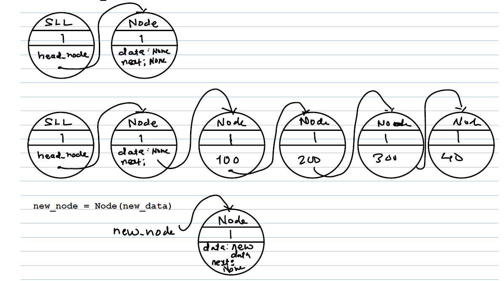

- Linkedlist is data structure where from **name given to one object is enough to reach out all the object in given address space** which are **linked with self referential structures**  
1. Node Passthrough  :
	- pass through constructor(similar like we write pass through shaders in OpenGL pp) is written just **to check whether control flow reaching at constructor or not**
```python
class Node:

def __init__(self):

	print("Inside node : __init__()")

	print("Node.__init__():id(self): ",id(self))

N = Node() # () is call operator

print("type(N) :",type(N),"id(N) :", id(N))
```

2. Node linked to next node
```python
class Node:

    def __init__(self,new_data:int):

        if type(new_data) != int:

            raise TypeError("bad type : new_data")

        self.data = new_data

        self.next = None

  
  

def main():
    N1 = Node(100)
    N2 = Node(200)
    N1.next = N2
    
    print("N1.__dict__:",N1.__dict__)
    print("N2.__dict__:",N2.__dict__)
main()  

"""
Output:
N1.__dict__: {'data': 100, 'next': <__main__.Node object at 0x000001800C666120>}
N2.__dict__: {'data': 200, 'next': None}
"""
```

3. Linkedlist of any entity
	- we used information structure (struct or class) to represent real life entities . ex. book , mobile, currency etc.
	- to manage multiple instances of these entities with one variable name we need to create another informational structure that we call **Self referential structure**
	```java
	class Book{
		String bookName;
		String author;
		String yearPublished; 
		double price;
		double rating;
		double discount;
	}

	class Node{
		Book book;
		Node node;
	}
		
	```

4. Head node concept
- wherever linked list implemented in system or language interpreter codes it is used with head node concept
- head node is dummy node which holds list with actual nodes with data acting as pivot or baton holder
- other nodes when removed linked list still exist because head node is present ,when we remove head node i.e self.head_node = None we are denying entire linked list

```python
class SinglyLinkedList:
	def __init__(self):
		self.head_node = Node(None)
```


